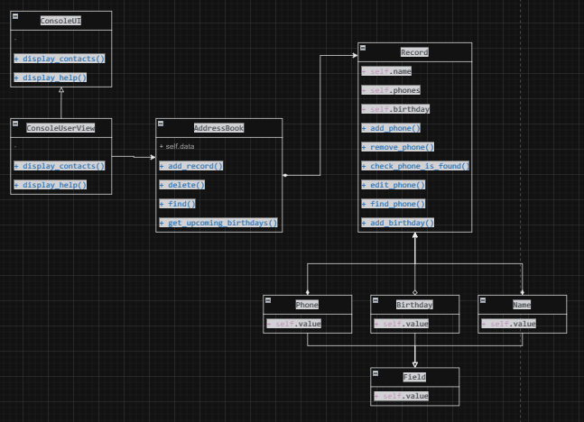

# WEB Modul 1 Homework

## Task

1.Draw the UML class diagrams for last work 
assignment "Personal Assistant" from the last repository.  \
2.Work is now running in console 
mode and interacts with the user in the form of 
commands in the console. The code has been improved
so that the presentation of information 
to the user (displaying cards with user contacts, 
a page with information about available commands) 
is easy to change.

## UML Class Diagram

